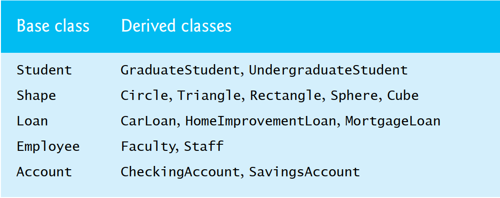
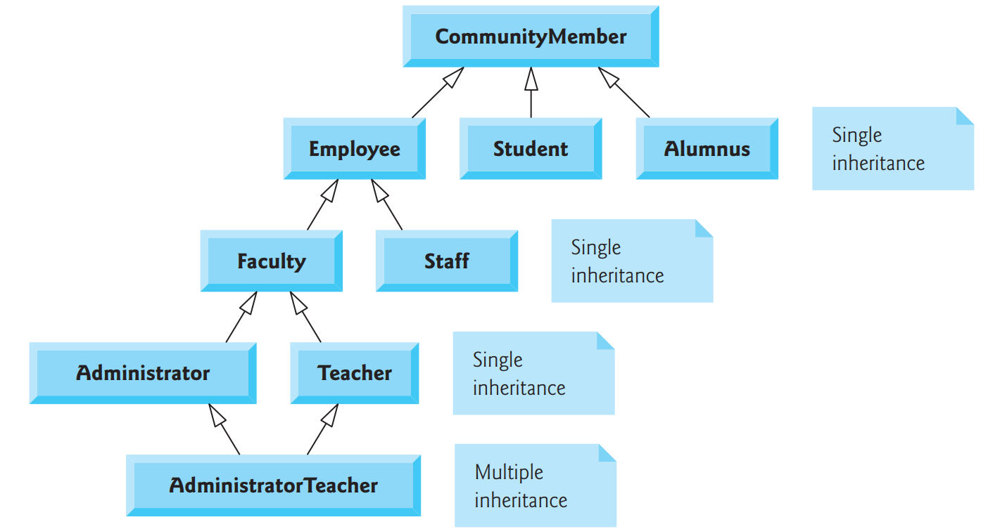
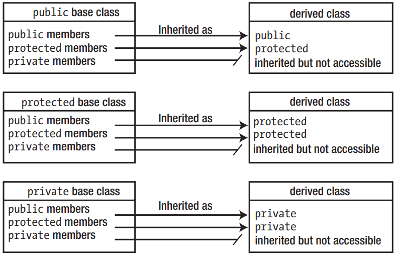
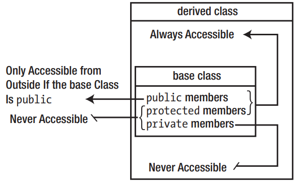

# C++ Object-Oriented Programming Tutorial
{: .no_toc }

## Table of contents
{: .no_toc .text-delta }

1. TOC
{:toc}

---


This tutorial covers the fundamental concepts of Object-Oriented Programming in C++ using a consistent Shape class hierarchy throughout the examples.

## 1. Basic Inheritance

Inheritance is a mechanism where a new class (derived class) can inherit properties and behaviors from an existing class (base class). This allows for code reuse and establishing relationships between classes.

When creating a class, instead of writing completely new data members and member functions, you can specify that the new class should *inherit* the members of an existing class. This existing class is called the *base class*, and the new class is called the *derived class*. Other programming languages, such as Java and C#, refer to the base class as the *superclass* and the derived class as the *subclass*. A derived class represents a more specialized group of objects. C++ offers public, protected and private inheritance. With public inheritance, every object of a derived class is also an object of that derived class’s base class. However, base-class objects are not objects of their derived classes. For example, if we have Vehicle as a base class and Car as a derived class, then all Cars are Vehicles, but not all Vehicles are Cars—for example, a Vehicle could also be a Truck or a Boat. 



Fig. 11.1 of [C++ How to Program](https://www.ebooksworld.ir/post/index/781), Global Edition, 10th Edition: Inheritance examples

We distinguish between the *is-a* relationship and the *has-a* relationship. The *is-a* relationship represents inheritance. In an is-a relationship, an object of a derived class also can be treated as an object of its base class—for example, a Car is a Vehicle, so any attributes and behaviors of a Vehicle are also attributes and behaviors of a Car. By contrast, the hasa relationship represents composition, which was discussed in Chapter 9. In a has-a relationship, an object contains one or more objects of other classes as members. For example, a Car has many components—it has a steering wheel, has a brake pedal, has a transmission, etc.


Inheritance relationships form class hierarchies. A base class exists in a hierarchical relationship with its derived classes. Although classes can exist independently, once they’re employed in inheritance relationships, they become affiliated with other classes. A class becomes either a base class—supplying members to other classes, a derived class—inheriting its members from other classes, or both.



Fig. 11.2 of [C++ How to Program](https://www.ebooksworld.ir/post/index/781), Global Edition, 10th Edition: Inheritance hierarchy for university CommunityMembers.


### 1.1 Shape Class Example

In this example, we create a base `Shape` class with protected width and height attributes, and two derived classes: `Rectangle` and `Triangle`. The derived classes inherit the attributes and methods from the base class.

```cpp
// Program 01_basic_inheritance.cpp
#include <iostream>
using namespace std;

// Base class
class Shape {
   protected:
      int width, height;
   public:
      Shape(int a = 0, int b = 0) {
         width = a;
         height = b;
      }      
      void display() {
         cout << "Width: " << width << ", Height: " << height << endl;
      }
};

// Derived class
class Rectangle: public Shape {
   public:
      Rectangle(int a = 0, int b = 0): Shape(a, b) { }      
      int area() {
         return (width * height);
      }
};

// Another derived class
class Triangle: public Shape {
   public:
      Triangle(int a = 0, int b = 0): Shape(a, b) { }      
      int area() {
         return (width * height / 2);
      }
};

int main() {
   Rectangle rect(5, 7);
   Triangle tri(5, 7);
   
   // Access base class method
   cout << "Rectangle dimensions:" << endl;
   rect.display();
   cout << "Rectangle area: " << rect.area() << endl;
   
   cout << "\nTriangle dimensions:" << endl;
   tri.display();
   cout << "Triangle area: " << tri.area() << endl;
   
   return 0;
}
```

**Key concepts demonstrated:**
- Base class and derived class relationship
- Protected members that are accessible to derived classes
- Method inheritance from base class to derived classes
- Constructor initialization in derived classes using base class constructor

## 2. Access Modifiers in Inheritance

C++ provides three access specifiers: public, protected, and private. These control the accessibility of base class members in derived classes. Additionally, inheritance itself can be public, protected, or private, which affects how the members of the base class are inherited.



Figure 13-3 of 'Beginning C++17 by Ivor Horton and Peter Van Weert (Apress, 2018)': The effect of the base class specifier on the accessibility of inherited members



Figure 13-4 of 'Beginning C++17 by Ivor Horton and Peter Van Weert (Apress, 2018)': The effect of access specifiers on base class members

```cpp
// Program 02_access_modifiers.cpp
#include <iostream>
using namespace std;

class Shape {
   private:
      int id;   
   protected:
      int width, height;   
   public:
      Shape(int a = 0, int b = 0, int i = 0) {
         width = a;
         height = b;
         id = i;
      }      
      int getId() { return id; }      
      void display() {
         cout << "ID: " << id << ", Width: " << width << ", Height: " << height << endl;
      }
};

// Public inheritance
class Rectangle: public Shape {
   public:
      Rectangle(int a = 0, int b = 0, int i = 0): Shape(a, b, i) { }      
      void accessDemo() {
         // Can access protected members
         cout << "Protected members width: " << width << ", height: " << height << endl;         
         // Cannot access private members directly
         // cout << "Private member id: " << id << endl; // This would cause error         
         // Can access public members
         cout << "Public method getId(): " << getId() << endl;
      }
};

// Protected inheritance
class Circle: protected Shape {
   public:
      Circle(int r = 0, int i = 0): Shape(r, r, i) { }      
      void accessDemo() {
         // Can access protected members
         cout << "Protected members width: " << width << ", height: " << height << endl;         
         // Can access public members (now protected in Circle)
         cout << "Protected method getId(): " << getId() << endl;
      }      
      // Need to provide public methods to access inherited public methods
      void displayCircle() {
         display();
      }
};

// Private inheritance
class Square: private Shape {
   public:
      Square(int a = 0, int i = 0): Shape(a, a, i) { }      
      void accessDemo() {
         // Can access protected members (now private in Square)
         cout << "Private members width: " << width << ", height: " << height << endl;         
         // Can access public members (now private in Square)
         cout << "Private method getId(): " << getId() << endl;
      }      
      // Need to provide public methods to access inherited methods
      void displaySquare() {
         display();
      }
};

int main() {
   Rectangle rect(5, 7, 1);
   Circle circle(5, 2);
   Square square(5, 3);
   
   cout << "Rectangle:" << endl;
   rect.display();  // Public method from Shape is accessible
   rect.accessDemo();
   
   cout << "\nCircle:" << endl;
   // circle.display();  // Error: protected inheritance makes public methods protected
   circle.displayCircle();  // Need to use wrapper method
   circle.accessDemo();
   
   cout << "\nSquare:" << endl;
   // square.display();  // Error: private inheritance makes public methods private
   square.displaySquare();  // Need to use wrapper method
   square.accessDemo();
   
   return 0;
}
```

**Key concepts demonstrated:**
- Private members (accessible only within the class)
- Protected members (accessible within the class and derived classes)
- Public members (accessible everywhere)
- Public inheritance (preserves access levels)
- Protected inheritance (public members become protected)
- Private inheritance (public and protected members become private)


Here's a concise English explanation you can add to your lesson page to accompany the new program:

---

### Understanding Protected vs Private Inheritance


```cpp
#include <iostream>
using namespace std;

class Shape {
   private:
      int id;   
   protected:
      int width, height;   
   public:
      Shape(int a = 0, int b = 0, int i = 0) {
         width = a;
         height = b;
         id = i;
      }      
      int getId() { return id; }      
      void display() {
         cout << "ID: " << id << ", Width: " << width << ", Height: " << height << endl;
      }
};

// Public inheritance
class Rectangle: public Shape {
   public:
      Rectangle(int a = 0, int b = 0, int i = 0): Shape(a, b, i) { }      
      void accessDemo() {
         // Can access protected members
         cout << "Protected members width: " << width << ", height: " << height << endl;         
         // Cannot access private members directly
         // cout << "Private member id: " << id << endl; // This would cause error         
         // Can access public members
         cout << "Public method getId(): " << getId() << endl;
      }
};

// Protected inheritance
class Circle: protected Shape {
   public:
      Circle(int r = 0, int i = 0): Shape(r, r, i) { }      
      void accessDemo() {
         // Can access protected members
         cout << "Protected members width: " << width << ", height: " << height << endl;         
         // Can access public members (now protected in Circle)
         cout << "Protected method getId(): " << getId() << endl;
      }      
      // Need to provide public methods to access inherited public methods
      void displayCircle() {
         display();
      }
};

// Class derived from Circle to show protected inheritance effect
class SpecialCircle: public Circle {
   public:
      SpecialCircle(int r = 0, int i = 0): Circle(r, i) {}
      void showAccess() {
         // Can access protected members from Shape (through Circle)
         cout << "Width from SpecialCircle: " << width << endl;
         // Can access protected methods from Shape (through Circle)
         cout << "ID from SpecialCircle: " << getId() << endl;
      }
};

// Private inheritance
class Square: private Shape {
   public:
      Square(int a = 0, int i = 0): Shape(a, a, i) { }      
      void accessDemo() {
         // Can access protected members (now private in Square)
         cout << "Private members width: " << width << ", height: " << height << endl;         
         // Can access public members (now private in Square)
         cout << "Private method getId(): " << getId() << endl;
      }      
      // Need to provide public methods to access inherited methods
      void displaySquare() {
         display();
      }
};

// Class derived from Square to show private inheritance effect
class SpecialSquare: public Square {
   public:
      SpecialSquare(int a = 0, int i = 0): Square(a, i) {}
      void tryAccess() {
         // Cannot access protected members from Shape (they're private in Square)
         // cout << "Trying to access width: " << width << endl; // Error
         // Cannot access public methods from Shape (they're private in Square)
         // cout << "Trying to access getId(): " << getId() << endl; // Error
         cout << "No access to Shape members in SpecialSquare!" << endl;
      }
};

int main() {
   Rectangle rect(5, 7, 1);
   Circle circle(5, 2);
   Square square(5, 3);
   SpecialCircle sc(6, 4);
   SpecialSquare ss(7, 5);
   
   cout << "Rectangle:" << endl;
   rect.display();  // Public method from Shape is accessible
   rect.accessDemo();
   
   cout << "\nCircle:" << endl;
   // circle.display();  // Error: protected inheritance makes public methods protected
   circle.displayCircle();  // Need to use wrapper method
   circle.accessDemo();
   
   cout << "\nSpecialCircle:" << endl;
   sc.showAccess();
   sc.displayCircle();
   
   cout << "\nSquare:" << endl;
   // square.display();  // Error: private inheritance makes public methods private
   square.displaySquare();  // Need to use wrapper method
   square.accessDemo();
   
   cout << "\nSpecialSquare:" << endl;
   ss.tryAccess();
   ss.displaySquare();
   
   return 0;
}
```

#### Key Modifications:
1. Added `SpecialCircle` (derived from `Circle`) to show protected inheritance effects
2. Added `SpecialSquare` (derived from `Square`) to show private inheritance effects

#### Critical Differences Shown:

| Aspect                | Protected Inheritance (`Circle`)          | Private Inheritance (`Square`)           |
|-----------------------|------------------------------------------|------------------------------------------|
| Base class public members become | Protected in derived class       | Private in derived class                |
| Access in further derived classes | Available (protected)            | Not available                           |
| External access       | Requires wrapper methods          | Requires wrapper methods                |

#### Key Observations:
- With **protected inheritance**:
  - `SpecialCircle` can access Shape's members through Circle
  - Original public methods become protected (need wrapper methods like `displayCircle()`)

- With **private inheritance**:
  - `SpecialSquare` cannot access any Shape members
  - All inheritance is effectively "hidden" from further derivation
  - Requires more wrapper methods (like `displaySquare()`)


## 3. Polymorphism

Polymorphism allows objects of different classes to be treated as objects of a common base class. In C++, this is achieved through virtual functions, which enable runtime method binding.

```cpp
// Program 03_polymorphism.cpp
#include <iostream>
using namespace std;

class Shape {
   protected:
      int width, height;

   public:
      Shape(int a = 0, int b = 0) {
         width = a;
         height = b;
      }
      
      // Virtual function
      virtual void display() {
         cout << "Shape with width: " << width << ", height: " << height << endl;
      }
      
      virtual int area() {
         cout << "Parent class area: 0" << endl;
         return 0;
      }
};

class Rectangle: public Shape {
   public:
      Rectangle(int a = 0, int b = 0): Shape(a, b) { }
      
      void display() override {
         cout << "Rectangle with width: " << width << ", height: " << height << endl;
      }
      
      int area() override {
         cout << "Rectangle class area: " << width * height << endl;
         return (width * height);
      }
};

class Triangle: public Shape {
   public:
      Triangle(int a = 0, int b = 0): Shape(a, b) { }
      
      void display() override {
         cout << "Triangle with width: " << width << ", height: " << height << endl;
      }
      
      int area() override {
         cout << "Triangle class area: " << (width * height)/2 << endl;
         return (width * height / 2);
      }
};

int main() {
   Shape *shape;
   Rectangle rec(10, 5);
   Triangle tri(10, 5);

   // Store the address of Rectangle
   shape = &rec;
   
   // Call Rectangle's display and area methods through Shape pointer
   shape->display();
   shape->area();

   // Store the address of Triangle
   shape = &tri;
   
   // Call Triangle's display and area methods through Shape pointer
   shape->display();
   shape->area();
   
   // Polymorphism with array of pointers
   cout << "\nPolymorphism with array of pointers:" << endl;
   Shape *shapes[2] = {&rec, &tri};
   
   for(int i = 0; i < 2; i++) {
      shapes[i]->display();
      shapes[i]->area();
   }

   return 0;
}
```

**Key concepts demonstrated:**
- Virtual functions for runtime polymorphism
- Method overriding in derived classes
- Base class pointers to derived class objects
- Dynamic dispatch of methods based on the actual object type
- The `override` keyword to explicitly indicate method overriding

## 4. Abstract Classes

Abstract classes are classes that cannot be instantiated directly and are designed to be subclassed. They often contain one or more pure virtual functions, which derived classes must implement.

```cpp
// Program 04_abstract_classes.cpp
#include <iostream>
using namespace std;

// Abstract class with pure virtual function
class Shape {
   protected:
      int width, height;

   public:
      Shape(int a = 0, int b = 0) {
         width = a;
         height = b;
      }
      
      // Pure virtual function makes this an abstract class
      virtual int area() = 0;
      
      // Regular virtual function
      virtual void display() {
         cout << "Shape dimensions - Width: " << width << ", Height: " << height << endl;
      }
};

class Rectangle: public Shape {
   public:
      Rectangle(int a = 0, int b = 0): Shape(a, b) { }
      
      // Must implement pure virtual function
      int area() override {
         cout << "Rectangle class area: " << width * height << endl;
         return (width * height);
      }
};

class Triangle: public Shape {
   public:
      Triangle(int a = 0, int b = 0): Shape(a, b) { }
      
      // Must implement pure virtual function
      int area() override {
         cout << "Triangle class area: " << (width * height)/2 << endl;
         return (width * height / 2);
      }
      
      // Override regular virtual function
      void display() override {
         cout << "Triangle dimensions - Base: " << width << ", Height: " << height << endl;
      }
};

class Circle: public Shape {
   public:
      Circle(int r = 0): Shape(r, 0) { }
      
      // Must implement pure virtual function
      int area() override {
         cout << "Circle class area: " << 3.14 * width * width << endl;
         return (3.14 * width * width);
      }
      
      // Override regular virtual function
      void display() override {
         cout << "Circle dimensions - Radius: " << width << endl;
      }
};

int main() {
   // Shape shape;  // Error: cannot instantiate abstract class
   
   Rectangle rec(10, 5);
   Triangle tri(10, 5);
   Circle cir(7);
   
   // Array of pointers to Shape
   Shape *shapes[3] = {&rec, &tri, &cir};
   
   for(int i = 0; i < 3; i++) {
      shapes[i]->display();
      shapes[i]->area();
      cout << endl;
   }

   return 0;
}
```

**Key concepts demonstrated:**
- Pure virtual functions (declared with `= 0`)
- Abstract classes that cannot be instantiated
- Concrete derived classes that implement all pure virtual functions
- Polymorphic behavior with abstract base classes
- Mix of regular virtual and pure virtual functions

## 5. Virtual Destructors

When using polymorphism, it's crucial to declare destructors as virtual in the base class. This ensures that when a derived class object is deleted through a base class pointer, both the derived and base class destructors are called.

```cpp
// Program 05_virtual_destructors.cpp
#include <iostream>
using namespace std;

class Shape {
   protected:
      int width, height;

   public:
      Shape(int a = 0, int b = 0) {
         width = a;
         height = b;
         cout << "Shape constructor called" << endl;
      }
      
      // Virtual destructor
      virtual ~Shape() {
         cout << "Shape destructor called" << endl;
      }
      
      virtual int area() = 0;
};

class Rectangle: public Shape {
   public:
      Rectangle(int a = 0, int b = 0): Shape(a, b) {
         cout << "Rectangle constructor called" << endl;
      }
      
      ~Rectangle() {
         cout << "Rectangle destructor called" << endl;
      }
      
      int area() override {
         return (width * height);
      }
};

class Triangle: public Shape {
   public:
      Triangle(int a = 0, int b = 0): Shape(a, b) {
         cout << "Triangle constructor called" << endl;
      }
      
      ~Triangle() {
         cout << "Triangle destructor called" << endl;
      }
      
      int area() override {
         return (width * height / 2);
      }
};

int main() {
   cout << "Creating a Rectangle object:" << endl;
   Shape *shape1 = new Rectangle(10, 5);
   cout << "Area: " << shape1->area() << endl;
   
   cout << "\nCreating a Triangle object:" << endl;
   Shape *shape2 = new Triangle(10, 5);
   cout << "Area: " << shape2->area() << endl;
   
   cout << "\nDeleting objects:" << endl;
   delete shape1;  // Calls both Rectangle and Shape destructors due to virtual destructor
   delete shape2;  // Calls both Triangle and Shape destructors due to virtual destructor
   
   return 0;
}
```

**Key concepts demonstrated:**
- Virtual destructors for proper cleanup in polymorphic hierarchies
- Constructor and destructor call sequence
- Memory management with polymorphic objects
- Importance of virtual destructors when using `delete` with base class pointers

## 6. Multiple Inheritance

Multiple inheritance allows a class to inherit from more than one base class. This can be useful for combining behaviors from different sources but requires careful design to avoid ambiguities.

```cpp
// Program 06_multiple_inheritance.cpp
#include <iostream>
using namespace std;

class Shape {
   protected:
      int width, height;

   public:
      Shape(int a = 0, int b = 0) {
         width = a;
         height = b;
         cout << "Shape constructor called" << endl;
      }
      
      virtual ~Shape() {
         cout << "Shape destructor called" << endl;
      }
      
      virtual int area() = 0;
};

class Printable {
   public:
      Printable() {
         cout << "Printable constructor called" << endl;
      }
      
      virtual ~Printable() {
         cout << "Printable destructor called" << endl;
      }
      
      virtual void print() = 0;
};

// Multiple inheritance
class Rectangle: public Shape, public Printable {
   public:
      Rectangle(int a = 0, int b = 0): Shape(a, b) {
         cout << "Rectangle constructor called" << endl;
      }
      
      ~Rectangle() {
         cout << "Rectangle destructor called" << endl;
      }
      
      int area() override {
         return (width * height);
      }
      
      void print() override {
         cout << "Rectangle with width " << width << " and height " << height << endl;
         cout << "Area: " << area() << endl;
      }
};

// Multiple inheritance
class Triangle: public Shape, public Printable {
   public:
      Triangle(int a = 0, int b = 0): Shape(a, b) {
         cout << "Triangle constructor called" << endl;
      }
      
      ~Triangle() {
         cout << "Triangle destructor called" << endl;
      }
      
      int area() override {
         return (width * height / 2);
      }
      
      void print() override {
         cout << "Triangle with base " << width << " and height " << height << endl;
         cout << "Area: " << area() << endl;
      }
};

int main() {
   cout << "Creating a Rectangle object:" << endl;
   Rectangle rect(10, 5);
   
   cout << "\nCreating a Triangle object:" << endl;
   Triangle tri(10, 5);
   
   cout << "\nPrinting objects:" << endl;
   rect.print();
   cout << endl;
   tri.print();
   
   cout << "\nPolymorphism with Printable interface:" << endl;
   Printable *printables[2] = {&rect, &tri};
   for(int i = 0; i < 2; i++) {
      printables[i]->print();
      cout << endl;
   }
   
   return 0;
}
```

**Key concepts demonstrated:**
- Inheriting from multiple base classes
- Constructor call sequence in multiple inheritance
- Interface-like classes with pure virtual functions
- Polymorphism with different base class types
- Implementation of methods from multiple base classes

# Further Reading

## 7. Virtual Base Classes

The diamond problem occurs in multiple inheritance when a class inherits from two classes that both inherit from a common base class. Virtual inheritance solves this by ensuring only one instance of the common base class exists.

```cpp
// Program 07_virtual_inheritance.cpp
```

**Key concepts demonstrated:**
- The diamond problem in multiple inheritance
- Virtual inheritance to solve the diamond problem
- Constructor initialization with virtual base classes
- Accessing members from a common base class
- Proper initialization of the virtual base class

## 8. Object Slicing and References

Object slicing occurs when a derived class object is assigned to a base class object, causing the derived class-specific members to be "sliced off". This can be avoided by using pointers or references.

```cpp
// Program 08_object_slicing.cpp
```

**Key concepts demonstrated:**
- Object slicing when passing by value
- Avoiding slicing by using references or pointers
- Polymorphic behavior with references vs. value semantics
- Container storage of polymorphic objects
- Proper techniques for working with polymorphic hierarchies

