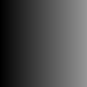
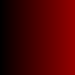
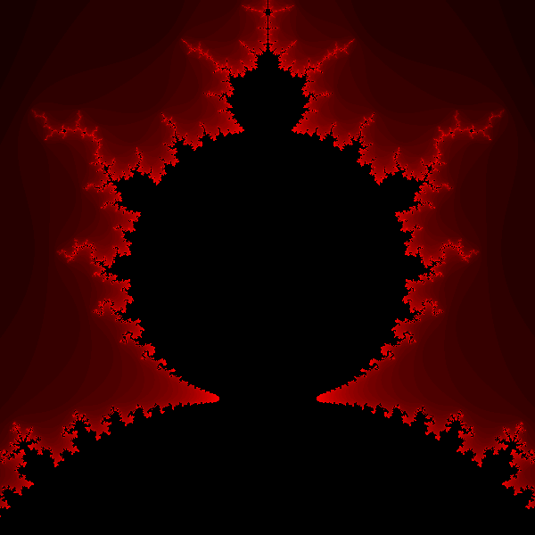

# Templates, Exceptions, Lambdas, Smart Pointers
{: .no_toc }

## Table of contents
{: .no_toc .text-delta }

1. TOC
{:toc}

          
# Tutorial: Creating Images with PPM Format in C++

## 1. Introduction to PPM Image Format

[PPM (Portable Pixmap Format)](https://en.wikipedia.org/wiki/Netpbm) is part of the Netpbm format family. There are three main variants:
- P1: PBM (Portable Bitmap) - Black and white images (1-bit)
- P2: PGM (Portable Graymap) - Grayscale images
- P3: PPM (Portable Pixmap) - Full color images

## 2. Basic PPM File Structure
A PPM file consists of:
1. Magic number (P1, P2, or P3)
2. Width and height
3. Maximum color value (for P2 and P3)
4. Image data

## 3. Creating Different Types of Image Files

### 3.1 Binary (PBM) Images
```cpp
// Program BitmapImage.cpp
#include <iostream>
#include <fstream>
using namespace std;

const int IMAGE_SIZE = 20;

void createBitmapImage(const int image[][IMAGE_SIZE], const char* filename, int size) {
    ofstream outFile(filename);
    if (!outFile) {
        cerr << "Error: Could not create " << filename << endl;
        return;
    }
    
    outFile << "P1\n" << size << " " << size << "\n";
    
    for (int i = 0; i < size; ++i) {
        for (int j = 0; j < size; ++j) {
            outFile << image[i][j] << ' ';
        }
        outFile << '\n';
    }
    outFile.close();
}

int main() {
    int bitmap[IMAGE_SIZE][IMAGE_SIZE] = {0};
    
    // Create diagonal pattern
    for (int i = 0; i < IMAGE_SIZE; ++i) {
        bitmap[i][i] = 1;
    }
    
    createBitmapImage(bitmap, "diagonal_pattern.pbm", IMAGE_SIZE);
    return 0;
}
```
PBM files use:
- Magic number: P1
- Only binary values (0 and 1)
- No maximum color value needed

Example output:
```plaintext
P1
20 20
1 0 0 0 0 0 0 0 0 0 0 0 0 0 0 0 0 0 0 0 
0 1 0 0 0 0 0 0 0 0 0 0 0 0 0 0 0 0 0 0 
0 0 1 0 0 0 0 0 0 0 0 0 0 0 0 0 0 0 0 0 
0 0 0 1 0 0 0 0 0 0 0 0 0 0 0 0 0 0 0 0 
0 0 0 0 1 0 0 0 0 0 0 0 0 0 0 0 0 0 0 0 
0 0 0 0 0 1 0 0 0 0 0 0 0 0 0 0 0 0 0 0 
0 0 0 0 0 0 1 0 0 0 0 0 0 0 0 0 0 0 0 0 
0 0 0 0 0 0 0 1 0 0 0 0 0 0 0 0 0 0 0 0 
0 0 0 0 0 0 0 0 1 0 0 0 0 0 0 0 0 0 0 0 
0 0 0 0 0 0 0 0 0 1 0 0 0 0 0 0 0 0 0 0 
0 0 0 0 0 0 0 0 0 0 1 0 0 0 0 0 0 0 0 0 
0 0 0 0 0 0 0 0 0 0 0 1 0 0 0 0 0 0 0 0 
0 0 0 0 0 0 0 0 0 0 0 0 1 0 0 0 0 0 0 0 
0 0 0 0 0 0 0 0 0 0 0 0 0 1 0 0 0 0 0 0 
0 0 0 0 0 0 0 0 0 0 0 0 0 0 1 0 0 0 0 0 
0 0 0 0 0 0 0 0 0 0 0 0 0 0 0 1 0 0 0 0 
0 0 0 0 0 0 0 0 0 0 0 0 0 0 0 0 1 0 0 0 
0 0 0 0 0 0 0 0 0 0 0 0 0 0 0 0 0 1 0 0 
0 0 0 0 0 0 0 0 0 0 0 0 0 0 0 0 0 0 1 0 
0 0 0 0 0 0 0 0 0 0 0 0 0 0 0 0 0 0 0 1 
```


### 3.2 Grayscale (PGM) Images
```cpp
// Program GrayscaleImage.cpp
#include <iostream>
#include <fstream>
using namespace std;

const int IMAGE_SIZE = 150;
const int MAX_GRAY_VALUE = 255;

void createGrayscaleImage(const int image[][IMAGE_SIZE], const char* filename, int size) {
    ofstream outFile(filename);
    if (!outFile) {
        cerr << "Error: Could not create " << filename << endl;
        return;
    }
    
    outFile << "P2\n" << size << " " << size << "\n" << MAX_GRAY_VALUE << "\n";
    
    for (int i = 0; i < size; ++i) {
        for (int j = 0; j < size; ++j) {
            outFile << image[i][j] << ' ';
        }
        outFile << '\n';
    }
    outFile.close();
}

int main() {
    int grayscale[IMAGE_SIZE][IMAGE_SIZE] = {0};
    
    // Create gradient pattern
    for (int i = 0; i < IMAGE_SIZE; ++i) {
        for (int j = 0; j < IMAGE_SIZE; ++j) {
            grayscale[i][j] = j;
        }
    }
    
    createGrayscaleImage(grayscale, "horizontal_gradient.pgm", IMAGE_SIZE);
    return 0;
}

```
PGM files feature:
- Magic number: P2
- Grayscale values
- Maximum intensity value

Example output:
```plaintext
P2
150 150
255
0 1 2 3 4 5 6 7 8 9 10 11 12 13 14 15 16 17 18 19 20 21 22 23 24 25 26 27 28 29 30 31 32 33 34 35 36 37 38 39 40 41 42 43 44 45 46 47 48 49 50 51 52 53 54 55 56 57 58 59 60 61 62 63 64 65 66 67 68 69 70 71 72 73 74 75 76 77 78 79 80 81 82 83 84 85 86 87 88 89 90 91 92 93 94 95 96 97 98 99 100 101 102 103 104 105 106 107 108 109 110 111 112 113 114 115 116 117 118 119 120 121 122 123 124 125 126 127 128 129 130 131 132 133 134 135 136 137 138 139 140 141 142 143 144 145 146 147 148 149 
0 1 2 3 4 5 6 7 8 9 10 11 12 13 14 15 16 17 18 19 20 21 22 23 24 25 26 27 28 29 30 31 32 33 34 35 36 37 38 39 40 41 42 43 44 45 46 47 48 49 50 51 52 53 54 55 56 57 58 59 60 61 62 63 64 65 66 67 68 69 70 71 72 73 74 75 76 77 78 79 80 81 82 83 84 85 86 87 88 89 90 91 92 93 94 95 96 97 98 99 100 101 102 103 104 105 106 107 108 109 110 111 112 113 114 115 116 117 118 119 120 121 122 123 124 125 126 127 128 129 130 131 132 133 134 135 136 137 138 139 140 141 142 143 144 145 146 147 148 149 

```



### 3.3 Color (PPM) Images
```cpp
// Program ColorImage.cpp
```
PPM files include:
- Magic number: P3
- Full RGB color values
- Three values per pixel

Example output:
```plaintext
P3
150 150
255
0 0 0 1 0 0 2 0 0 3 0 0 4 0 0 5 0 0 6 0 0 7 0 0 8 0 0 9 0 0 10 0 0 11 0 0 12 0 0 13 0 0 14 0 0 15 0 0 16 0 0 17 0 0 18 0 0 19 0 0 20 0 0 21 0 0 22 0 0 23 0 0 24 0 0 25 0 0 26 0 0 27 0 0 28 0 0 29 0 0 30 0 0 31 0 0 32 0 0 33 0 0 34 0 0 35 0 0 36 0 0 37 0 0 38 0 0 39 0 0 40 0 0 41 0 0 42 0 0 43 0 0 44 0 0 45 0 0 46 0 0 47 0 0 48 0 0 49 0 0 50 0 0 51 0 0 52 0 0 53 0 0 54 0 0 55 0 0 56 0 0 57 0 0 58 0 0 59 0 0 60 0 0 61 0 0 62 0 0 63 0 0 64 0 0 65 0 0 66 0 0 67 0 0 68 0 0 69 0 0 70 0 0 71 0 0 72 0 0 73 0 0 74 0 0 75 0 0 76 0 0 77 0 0 78 0 0 79 0 0 80 0 0 81 0 0 82 0 0 83 0 0 84 0 0 85 0 0 86 0 0 87 0 0 88 0 0 89 0 0 90 0 0 91 0 0 92 0 0 93 0 0 94 0 0 95 0 0 96 0 0 97 0 0 98 0 0 99 0 0 100 0 0 101 0 0 102 0 0 103 0 0 104 0 0 105 0 0 106 0 0 107 0 0 108 0 0 109 0 0 110 0 0 111 0 0 112 0 0 113 0 0 114 0 0 115 0 0 116 0 0 117 0 0 118 0 0 119 0 0 120 0 0 121 0 0 122 0 0 123 0 0 124 0 0 125 0 0 126 0 0 127 0 0 128 0 0 129 0 0 130 0 0 131 0 0 132 0 0 133 0 0 134 0 0 135 0 0 136 0 0 137 0 0 138 0 0 139 0 0 140 0 0 141 0 0 142 0 0 143 0 0 144 0 0 145 0 0 146 0 0 147 0 0 148 0 0 149 0 0 
0 0 0 1 0 0 2 0 0 3 0 0 4 0 0 5 0 0 6 0 0 7 0 0 8 0 0 9 0 0 10 0 0 11 0 0 12 0 0 13 0 0 14 0 0 15 0 0 16 0 0 17 0 0 18 0 0 19 0 0 20 0 0 21 0 0 22 0 0 23 0 0 24 0 0 25 0 0 26 0 0 27 0 0 28 0 0 29 0 0 30 0 0 31 0 0 32 0 0 33 0 0 34 0 0 35 0 0 36 0 0 37 0 0 38 0 0 39 0 0 40 0 0 41 0 0 42 0 0 43 0 0 44 0 0 45 0 0 46 0 0 47 0 0 48 0 0 49 0 0 50 0 0 51 0 0 52 0 0 53 0 0 54 0 0 55 0 0 56 0 0 57 0 0 58 0 0 59 0 0 60 0 0 61 0 0 62 0 0 63 0 0 64 0 0 65 0 0 66 0 0 67 0 0 68 0 0 69 0 0 70 0 0 71 0 0 72 0 0 73 0 0 74 0 0 75 0 0 76 0 0 77 0 0 78 0 0 79 0 0 80 0 0 81 0 0 82 0 0 83 0 0 84 0 0 85 0 0 86 0 0 87 0 0 88 0 0 89 0 0 90 0 0 91 0 0 92 0 0 93 0 0 94 0 0 95 0 0 96 0 0 97 0 0 98 0 0 99 0 0 100 0 0 101 0 0 102 0 0 103 0 0 104 0 0 105 0 0 106 0 0 107 0 0 108 0 0 109 0 0 110 0 0 111 0 0 112 0 0 113 0 0 114 0 0 115 0 0 116 0 0 117 0 0 118 0 0 119 0 0 120 0 0 121 0 0 122 0 0 123 0 0 124 0 0 125 0 0 126 0 0 127 0 0 128 0 0 129 0 0 130 0 0 131 0 0 132 0 0 133 0 0 134 0 0 135 0 0 136 0 0 137 0 0 138 0 0 139 0 0 140 0 0 141 0 0 142 0 0 143 0 0 144 0 0 145 0 0 146 0 0 147 0 0 148 0 0 149 0 0 
```



### 3.4 Creating the Iranian Flag
```cpp
// Program IranianFlag.cpp
```
This program demonstrates:
1. Creating multiple colored stripes
2. Using different RGB values for each stripe
3. Organizing pixels in rows and columns

Example output:
```plaintext
P3
300 200
255
0 255 0    0 255 0    0 255 0    # Green stripe
255 255 255  255 255 255  ...     # White stripe
255 0 0    255 0 0    255 0 0    # Red stripe
```


## 4. The Mandelbrot Set (Further Reading)

### 4.1 Introduction to Fractals
A [fractal]("https://en.wikipedia.org/wiki/Fractal") is a geometric figure that repeats its pattern at different scales. The [Mandelbrot set]("https://en.wikipedia.org/wiki/Mandelbrot_set) is one of the most famous fractals, discovered by Benoit Mandelbrot in 1978.

### 4.2 Complex Numbers Primer
<mcurl name="Complex numbers" url="https://en.wikipedia.org/wiki/Complex_number"></mcurl> are numbers in the form a + bi, where:
- a is the real part
- b is the imaginary part
- i is the imaginary unit (√-1)

In C++, we use the `complex` template class:
```cpp
complex<float> z(real, imaginary);
```

### 4.3 Generating the Mandelbrot Fractal

The Mandelbrot set is generated by iterating a simple mathematical formula for complex numbers:

```math
z_{n+1} = z_n^2 + c
```

Where:
- `z` starts at 0
- `c` represents each point in the complex plane
- The iteration continues until either:
  - The magnitude exceeds 2 (point is outside the set)
  - A maximum iteration count is reached (point is inside the set)

The color of each pixel typically represents how quickly the point escapes (if at all), creating the characteristic fractal patterns.
Points that remain bounded (belong to the set) are often colored black, while points that diverge (outside the set) can be colored with different colors to indicate how quickly they diverge,

#### Connection to Random Number Generation

Interestingly, the chaotic behavior of the Mandelbrot iteration shares some conceptual similarities with [pseudorandom number generators](https://en.wikipedia.org/wiki/Random_number_generation):

1. Both use iterative processes (the Mandelbrot formula vs. PRNG algorithms)
2. Small changes in initial conditions lead to dramatically different results
3. The output appears random but is completely deterministic
4. Both can be used to create visual patterns (fractals vs. random noise textures)

However, while PRNGs are designed for uniform distribution, the Mandelbrot set's "randomness" emerges from its mathematical properties.

### 4.4 The Mandelbrot Set Program 

```cpp
// Program mandelbrot.cpp
#include <iostream>
#include <fstream>
#include <complex>
using namespace std;

const int WIDTH = 600;
const int HEIGHT = 600;
const int MAX_ITERATIONS = 34;
const int COLOR_DEPTH = 255;

int calculateMandelbrotValue(int x, int y) {
    complex<float> point((float)x/HEIGHT-1.5f, (float)y/WIDTH-0.5f);
    complex<float> z(0, 0);
    int iterations = 0;
    
    while (abs(z) < 2 && iterations <= MAX_ITERATIONS) {
        z = z * z + point;
        iterations++;
    }
    
    return (iterations < MAX_ITERATIONS) ? (COLOR_DEPTH*iterations)/(MAX_ITERATIONS) : 0;
}

int main() {
    ofstream fractalImage("mandelbrot_set.ppm");
    
    if (!fractalImage) {
        cerr << "Error: Could not create fractal image file\n";
        return 1;
    }
    
    // Write PPM header
    fractalImage << "P3\n" << WIDTH << " " << HEIGHT << " " << COLOR_DEPTH << "\n";
    
    // Generate fractal
    for (int y = 0; y < HEIGHT; ++y) {
        for (int x = 0; x < WIDTH; ++x) {
            int colorValue = calculateMandelbrotValue(y, x);
            fractalImage << colorValue << " 0 0\n"; // Red channel only
        }
    }
    
    fractalImage.close();
    cout << "Mandelbrot set image created successfully.\n";
    return 0;
}
```

This program:
1. Uses complex numbers to represent points in the complex plane
2. Iterates the function f(z) = z² + c
3. Colors pixels based on how quickly points escape
4. Creates a PPM image of the resulting fractal



## Tips for Working with PPM Files
1. Always write the header correctly
2. Close files after writing
3. Use proper spacing between values
4. Remember RGB order for color images
5. Keep maximum color value consistent

This tutorial provides a foundation for creating various types of images using C++ and the PPM format family, from simple colored shapes to complex fractals.

### Viewing the Generated Images

To view the generated PBM/PGM/PPM files, you have several options:

1. Use specialized image viewers that support Netpbm formats directly, such as:
   - IrfanView (Windows)
   - GIMP (Cross-platform)
   - XnView (Cross-platform)

2. Convert to more common formats like PNG using tools like:
   - ImageMagick (command line: `magick input.ppm output.png`)
   - Online conversion tools

3. Some operating systems may have built-in preview capabilities for these formats
